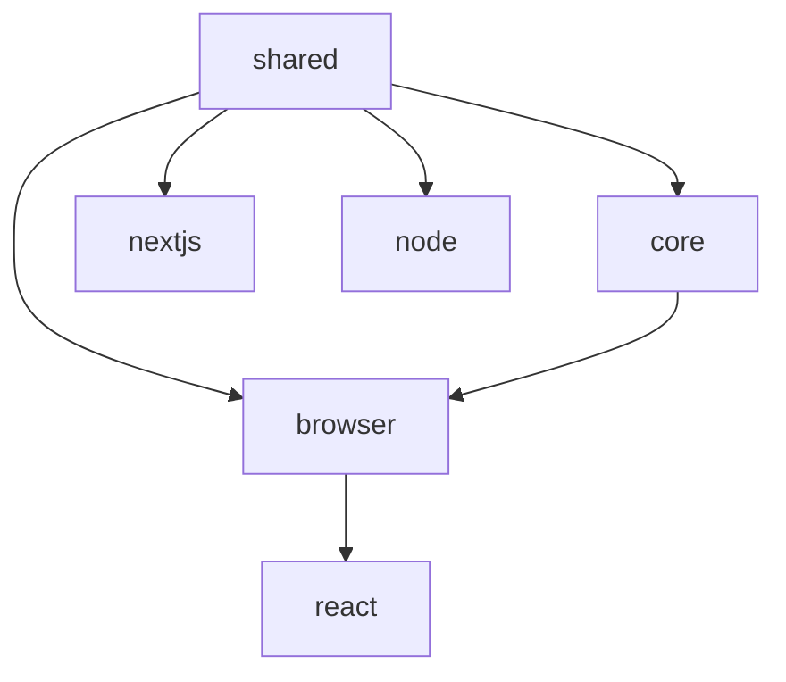

# Xaiku SDK

Enterprise-grade A/B testing and analytics platform with comprehensive tracking, performance monitoring, and conversion optimization tools.

## Overview

The Xaiku SDK is a modern, performant solution for running sophisticated A/B tests and capturing detailed user analytics. Built for high-traffic applications, it provides real-time variant serving, comprehensive event tracking, and advanced performance monitoring.

## Features

### 🚀 A/B Testing & Variant Management
- **Deterministic Variant Selection** - Consistent user experiences across sessions
- **Weighted Distribution** - Flexible traffic allocation with custom weights  
- **Multi-Project Support** - Run multiple tests simultaneously
- **Real-time Variant Updates** - Change test configurations without deployments

### 📊 Advanced Analytics & Tracking
- **Impression Tracking** - Deduplication prevents duplicate events on re-renders
- **Conversion Funnels** - Multi-step attribution with time-based analysis
- **Engagement Metrics** - Scroll depth, dwell time, interaction patterns
- **Performance Impact** - Monitor how variants affect Core Web Vitals

### ⚡ Performance & Optimization  
- **Core Web Vitals** - CLS, FCP, FID, LCP, TTFB, INP monitoring
- **Adaptive Tracking** - Reduces resource usage on low-end devices
- **Event Batching** - Efficient network usage with configurable batching
- **Memory Management** - LRU caching prevents memory leaks

### 🛡️ Production-Ready Reliability
- **Error Boundaries** - Graceful fallbacks when variants fail
- **Type Safety** - Comprehensive TypeScript definitions
- **Framework Support** - React, Next.js, vanilla JavaScript
- **Browser Compatibility** - Modern browsers with graceful degradation

## Quick Start

### React Integration

```bash
npm install @xaiku/react
```

```jsx
import React from 'react'
import { XaikuProvider, Text } from '@xaiku/react'

function App() {
  return (
    <XaikuProvider 
      apiUrl="https://api.xaiku.com"
      pkey="your-public-key"
    >
      <Text 
        projectId="homepage-hero" 
        id="headline" 
        fallback="Welcome to our platform!"
      >
        {(text) => <h1>{text}</h1>}
      </Text>
    </XaikuProvider>
  )
}
```

### Browser/Vanilla JavaScript

```bash
npm install @xaiku/browser
```

```javascript
import xaiku from '@xaiku/browser'

const sdk = xaiku({
  apiUrl: 'https://api.xaiku.com',
  pkey: 'your-public-key',
  projectIds: ['homepage-test']
})

// Get variant text
const headline = sdk.getVariantText('homepage-test', 'headline', {
  fallback: 'Default headline'
})

// Track conversion
sdk.track.events.trackConversion({
  projectId: 'homepage-test',
  value: 29.99,
  currency: 'USD'
})
```

### Next.js Integration

```bash
npm install @xaiku/nextjs
```

```javascript
// middleware.js
import { xaikuMiddleware } from '@xaiku/nextjs'

export default xaikuMiddleware({
  apiUrl: 'https://api.xaiku.com',
  pkey: 'your-public-key'
})

export const config = {
  matcher: ['/((?!api|_next/static|_next/image|favicon.ico).*)']
}
```

## Architecture

### Monorepo Structure

```
xaiku-sdk/
├── packages/
│   ├── core/          # Core SDK functionality
│   ├── shared/        # Shared utilities and types  
│   ├── browser/       # Browser-specific features
│   ├── react/         # React components & hooks
│   ├── nextjs/        # Next.js middleware & utilities
│   ├── node/          # Node.js server utilities
│   └── config/        # Build & lint configurations
```

### Package Dependencies



## Packages

### [@xaiku/react](./packages/react/README.md)
React components and hooks for A/B testing with advanced tracking capabilities.

**Key Features:**
- `<Text>` component with automatic impression tracking
- Advanced hooks for engagement, scroll depth, and conversion tracking
- Error boundaries with variant-specific fallbacks
- Performance optimization utilities

### [@xaiku/browser](./packages/browser/README.md)  
Browser-focused SDK with DOM interaction tracking and performance monitoring.

**Key Features:**
- Core Web Vitals monitoring (CLS, FCP, FID, LCP, TTFB, INP)
- DOM proxying for fetch, history, and timer tracking
- Intersection Observer integration for visibility tracking
- Resource timing and performance analysis

### [@xaiku/shared](./packages/shared/README.md)
Core utilities and shared functionality used across all packages.

**Key Features:**
- Pluggable storage system (localStorage, sessionStorage, cookie, memory)
- Event system with automatic cleanup
- Performance metrics collection
- Variant selection algorithms

### [@xaiku/core](./packages/core/README.md)
Core SDK factory and client implementation.

### [@xaiku/nextjs](./packages/nextjs/README.md)
Next.js middleware and server-side utilities.

### [@xaiku/node](./packages/node/README.md)
Node.js server implementation for server-side tracking.

## Advanced Usage

### Comprehensive E-commerce Tracking

```jsx
import { 
  XaikuProvider, 
  Text,
  useTrackConversion,
  useTrackScrollDepth,
  useTrackEngagement 
} from '@xaiku/react'

function ProductPage({ productId }) {
  // Conversion tracking with funnel analysis
  const { trackFunnelStep, trackConversion } = useTrackConversion({
    projectId: 'product-conversion',
    partId: `product-${productId}`
  })

  // Engagement monitoring
  const { isTracking } = useTrackEngagement({
    projectId: 'product-engagement',
    partId: 'product-details'
  })

  // Scroll depth analysis
  useTrackScrollDepth({
    projectId: 'content-engagement',
    milestones: [25, 50, 75, 100]
  })

  const handleAddToCart = () => {
    trackFunnelStep('add_to_cart', { productId, price: 49.99 })
  }

  const handlePurchase = (orderData) => {
    trackConversion({ 
      revenue: orderData.total,
      items: orderData.items,
      currency: 'USD' 
    })
  }

  return (
    <div>
      <Text projectId="product-title" id="name" fallback="Product Name">
        {(title) => <h1>{title}</h1>}
      </Text>

      <div className={`engagement ${isTracking ? 'active' : 'idle'}`}>
        <Text projectId="product-description" id="desc" 
              fallback="Product description" />
      </div>

      <button onClick={handleAddToCart}>
        <Text projectId="cta-buttons" id="add-to-cart" 
              fallback="Add to Cart" />
      </button>
    </div>
  )
}
```

### Performance-Optimized Implementation

```jsx
import { 
  useAdaptiveTracking,
  useBatchedTracking,
  usePerformanceOptimization 
} from '@xaiku/react'

function OptimizedApp() {
  // Adaptive tracking based on device capabilities
  const { shouldTrackEvent, getTrackingStrategy } = useAdaptiveTracking()
  
  // Batched event processing
  const addToBatch = useBatchedTracking(sdk, 25, 3000)
  
  // Performance monitoring with recommendations
  const { 
    getOptimizationRecommendations,
    recordRenderTime 
  } = usePerformanceOptimization()

  const trackEvent = (eventType, data) => {
    if (shouldTrackEvent(eventType)) {
      addToBatch({ type: eventType, data, timestamp: Date.now() })
    }
  }

  useEffect(() => {
    const recommendations = getOptimizationRecommendations()
    if (recommendations.length > 0) {
      console.log('Performance recommendations:', recommendations)
    }
  })

  return (
    <div>
      <p>Tracking Strategy: {getTrackingStrategy()}</p>
      {/* Your app content */}
    </div>
  )
}
```

## Development Commands

### Root Level Commands
```bash
# Install all dependencies
pnpm install

# Build all packages
pnpm build

# Run tests across all packages  
pnpm test

# Lint all packages
pnpm lint

# Clean all build artifacts
pnpm clean

# Format code with Prettier
pnpm format
```

### Package-Specific Commands
```bash
# Work with specific packages
cd packages/react

# Build single package
pnpm build

# Run tests for package
pnpm test

# Start Storybook (react/browser packages)
pnpm storybook
```

### Release Management
```bash
# Create changesets for versioning
pnpm changes

# Version packages based on changesets
pnpm version  

# Publish packages to npm
pnpm release
```

## TypeScript Support

Comprehensive TypeScript definitions included:

```typescript
import type { 
  XaikuSDK, 
  TrackingEvent,
  VariantConfig,
  PerformanceMetric 
} from '@xaiku/core'

interface CustomTrackingData {
  userId: string
  experimentId: string
  variantId: string
}

const sdk: XaikuSDK = xaiku({ /* config */ })
```

## Browser Compatibility

- **Modern Browsers**: Full support
  - Chrome 60+, Firefox 60+, Safari 12+, Edge 79+
- **Legacy Support**: Core functionality with polyfills
  - IE 11, Chrome 50+, Safari 10+
- **Mobile**: iOS Safari 12+, Chrome Mobile 60+

## Performance Benchmarks

- **Bundle Size**: 8-12KB gzipped per package
- **Runtime Overhead**: <1ms per tracked event
- **Memory Usage**: ~2MB baseline, scales linearly
- **Network Efficiency**: Batched requests, ~1 request/5 seconds
- **CPU Usage**: Passive listeners, requestIdleCallback optimization

## Examples & Templates

- [React E-commerce](./examples/react-ecommerce)
- [Next.js Blog](./examples/nextjs-blog)  
- [Vanilla JS Landing Page](./examples/vanilla-landing)
- [Performance Monitoring](./examples/performance-monitoring)

## Documentation

- [Getting Started Guide](./docs/getting-started.md)
- [React Components & Hooks](./packages/react/docs/)
- [Advanced Tracking](./packages/react/docs/ADVANCED_TRACKING.md)
- [Performance Optimization](./packages/react/docs/PERFORMANCE.md)
- [Error Handling](./packages/react/docs/ERROR_HANDLING.md)
- [API Reference](./docs/api-reference.md)

## Contributing

We welcome contributions! Please see our [Contributing Guide](./CONTRIBUTING.md) for details.

### Development Setup

```bash
# Clone repository
git clone https://github.com/your-org/xaiku-sdk.git
cd xaiku-sdk

# Install dependencies
pnpm install

# Build packages
pnpm build

# Run tests
pnpm test

# Start development
pnpm dev
```

## License

MIT License - see [LICENSE](./LICENSE) for details.

## Support

- [Documentation](https://docs.xaiku.com)
- [GitHub Issues](https://github.com/your-org/xaiku-sdk/issues)
- [Community Discord](https://discord.gg/xaiku)
- [Email Support](mailto:support@xaiku.com)

---

Built with ❤️ for modern web applications